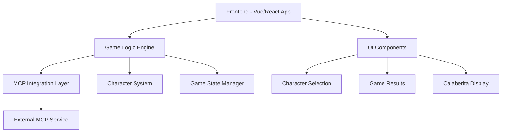

# Design Document

## Overview

El juego "Día de los Muertos: Piedra, Papel o Tijeras" es una aplicación web interactiva que reimagina el clásico juego usando personajes icónicos de la tradición mexicana del Día de los Muertos. La aplicación integra un servicio MCP (Model Context Protocol) para generar calaberitas auténticas que enriquecen la experiencia cultural del usuario.

## Architecture

### High-Level Architecture



### Technology Stack

- **Frontend Framework**: TypeScript + Vite (existing setup)
- **Styling**: CSS with Day of the Dead themed design
- **MCP Integration**: Fetch API for HTTP requests to MCP service
- **State Management**: Local component state with TypeScript interfaces
- **Recommended MCP**: Claude MCP Server or custom poetry generation service

## Components and Interfaces

### Core Components

#### 1. GameEngine
```typescript
interface GameEngine {
  playerChoice: Character | null;
  computerChoice: Character | null;
  gameResult: GameResult;
  playRound(playerSelection: Character): Promise<GameResult>;
  resetGame(): void;
}
```

#### 2. Character System
```typescript
enum Character {
  CATRINA = 'catrina',      // Beats Calavera (like paper beats rock)
  CALAVERA = 'calavera',    // Beats Mariachi (like rock beats scissors)  
  MARIACHI = 'mariachi'     // Beats Catrina (like scissors beats paper)
}

interface CharacterInfo {
  name: string;
  displayName: string;
  description: string;
  imageUrl: string;
  beats: Character;
}
```

#### 3. MCP Integration
```typescript
interface MCPService {
  generateCalaverita(context: CalaveritaContext): Promise<string>;
  isAvailable(): Promise<boolean>;
}

interface CalaveritaContext {
  type: 'selection' | 'victory' | 'defeat';
  playerCharacter?: Character;
  computerCharacter?: Character;
  gameResult?: GameResult;
}
```

#### 4. UI Components
```typescript
interface GameUI {
  CharacterSelector: Component;
  CalaveritaDisplay: Component;
  GameResult: Component;
  ScoreBoard: Component;
}

// SVG Character Components
interface SVGCharacterComponents {
  CatrinaSVG: () => string;    // Elegant lady of death with hat and dress
  CalaveraSVG: () => string;   // Colorful decorated skull
  MariachiSVG: () => string;   // Skeleton musician with sombrero and guitar
}
```

### MCP Service Recommendation

**Recommended MCP**: **FastMCP Poetry Server** or **Claude MCP Server**

Configuration for `.kiro/settings/mcp.json`:
```json
{
  "mcpServers": {
    "poetry-generator": {
      "command": "uvx",
      "args": ["fastmcp-poetry@latest"],
      "env": {
        "FASTMCP_LOG_LEVEL": "ERROR",
        "LANGUAGE": "es",
        "THEME": "dia-de-muertos"
      },
      "disabled": false,
      "autoApprove": ["generate_poem", "generate_verse"]
    }
  }
}
```

## Data Models

### Game State
```typescript
interface GameState {
  currentRound: number;
  playerScore: number;
  computerScore: number;
  gamePhase: 'selection' | 'revealing' | 'result' | 'calaberita';
  currentCalaverita: string | null;
  isLoading: boolean;
}

enum GameResult {
  PLAYER_WINS = 'player_wins',
  COMPUTER_WINS = 'computer_wins', 
  TIE = 'tie'
}
```

### Character Definitions
```typescript
interface CharacterInfo {
  name: string;
  displayName: string;
  description: string;
  svgComponent: string; // SVG markup as string
  beats: Character;
}

const CHARACTERS: Record<Character, CharacterInfo> = {
  [Character.CATRINA]: {
    name: 'catrina',
    displayName: 'La Catrina',
    description: 'Elegante dama de la muerte',
    svgComponent: 'CatrinaSVG', // Custom SVG component
    beats: Character.CALAVERA
  },
  [Character.CALAVERA]: {
    name: 'calavera',
    displayName: 'La Calavera',
    description: 'Cráneo festivo y colorido',
    svgComponent: 'CalaveraSVG', // Custom SVG component
    beats: Character.MARIACHI
  },
  [Character.MARIACHI]: {
    name: 'mariachi',
    displayName: 'El Mariachi Muerto',
    description: 'Músico del más allá',
    svgComponent: 'MariachiSVG', // Custom SVG component
    beats: Character.CATRINA
  }
};
```

## Error Handling

### MCP Service Failures
- **Connection Timeout**: Display fallback calaberitas stored locally
- **Service Unavailable**: Show traditional Day of the Dead phrases
- **Invalid Response**: Log error and use backup content
- **Rate Limiting**: Implement request queuing with exponential backoff

### Fallback Calaberitas
```typescript
const FALLBACK_CALABERITAS = {
  selection: [
    "Elige tu personaje, querido jugador,\nque el destino te sonría con favor",
    "En esta noche de muertos y flores,\n¿cuál será tu elección entre colores?"
  ],
  computerWins: [
    "La computadora te ha ganado esta vez,\n¡pero no te rindas, juega otra vez!",
    "Ay, querido amigo, has perdido el round,\n¡la máquina baila al son del sound!"
  ]
};
```

## Testing Strategy

### Unit Testing
- Character selection logic
- Game result calculation
- MCP service integration (with mocks)
- Fallback mechanism functionality

### Integration Testing  
- End-to-end game flow
- MCP service communication
- Error handling scenarios
- UI component interactions

### Manual Testing
- Cultural appropriateness of generated calaberitas
- Visual design and animations
- Responsive behavior across devices
- Performance with MCP service calls

## Visual Design

### Color Palette (Pixel Art Optimized)
- **Primary**: Orange (#FF6B35) - Marigold flowers
- **Secondary**: Purple (#8E44AD) - Traditional Day of the Dead
- **Accent**: Gold (#F1C40F) - Celebration and festivity
- **Background**: Dark Navy (#2C3E50) - Night sky
- **Text**: Cream (#FDF2E9) - Papel picado
- **Pixel White**: (#FFFFFF) - Pure white for pixel contrast
- **Pixel Black**: (#000000) - Pure black for pixel outlines

### Typography
- **Headers**: Pixel-style font (8-bit gaming aesthetic)
- **Body**: Monospace font for retro gaming feel
- **Calaberitas**: Pixel-style decorative font for consistency

### Animations (Pixel Art Compatible)
- Character selection: Simple 2-frame pixel animation (idle/selected)
- Hover effects: Color palette swaps without anti-aliasing
- Reveal animations: Pixelated fade-in effects
- Victory celebrations: Simple bouncing pixel animations
- Smooth transitions with `image-rendering: pixelated` maintained

## SVG Character Design Specifications

### Pixel Art Style Guidelines
- **Art Style**: 8-bit/16-bit pixel art aesthetic
- **Grid System**: 32x32 pixel base grid for character elements
- **Shape-rendering**: Use `shape-rendering="crispEdges"` for sharp pixel edges
- **No Anti-aliasing**: Maintain crisp, blocky pixel appearance
- **Limited Color Palette**: Maximum 8 colors per character for authentic retro feel

### La Catrina SVG (Pixel Art)
- **Style**: Pixelated elegant skeletal figure in Victorian dress
- **Colors**: Purple dress (#8E44AD), gold accents (#F1C40F), bone white (#FDF2E9)
- **Elements**: Blocky decorative hat with pixelated flowers, rectangular dress, square skeletal hands
- **Size**: 128x192px (4:3 ratio) for pixel-perfect scaling
- **Pixel Details**: Large hat brim (32px wide), dress with simple geometric patterns

### La Calavera SVG (Pixel Art)
- **Style**: Pixelated sugar skull with blocky decorative patterns
- **Colors**: Bright marigold orange (#FF6B35), purple details (#8E44AD), white base (#FDF2E9)
- **Elements**: Square eye sockets, geometric floral patterns, pixelated teeth
- **Size**: 128x128px (perfect square) for consistent pixel grid
- **Pixel Details**: 8x8 pixel flowers, 4x4 pixel geometric decorations

### El Mariachi Muerto SVG (Pixel Art)
- **Style**: Pixelated skeleton musician with blocky mariachi outfit
- **Colors**: Black charro suit (#2C3E50), gold trim (#F1C40F), red accents (#E74C3C)
- **Elements**: Square sombrero, rectangular guitar, pixelated skeletal figure
- **Size**: 128x192px matching Catrina proportions
- **Pixel Details**: 16x16 pixel sombrero, simplified guitar with basic rectangular body

### Pixel Art SVG Implementation Strategy
- Use `<rect>` elements exclusively for pixel-perfect blocks
- Implement each "pixel" as a 4x4px rectangle for scalability
- Apply `shape-rendering="crispEdges"` to all SVG elements
- Use CSS `image-rendering: pixelated` for browser scaling
- Create modular pixel components for reusable elements (eyes, flowers, etc.)
- Include accessibility attributes with pixel art descriptions

## Implementation Phases

1. **SVG Character Creation**: Design and implement custom SVG components for each character
2. **Core Game Logic**: Implement basic rock-paper-scissors with characters
3. **MCP Integration**: Set up service communication and fallbacks  
4. **UI Development**: Create themed interface components with SVG integration
5. **Calaberita System**: Integrate text generation and display
6. **Polish & Testing**: Animations, error handling, and cultural review